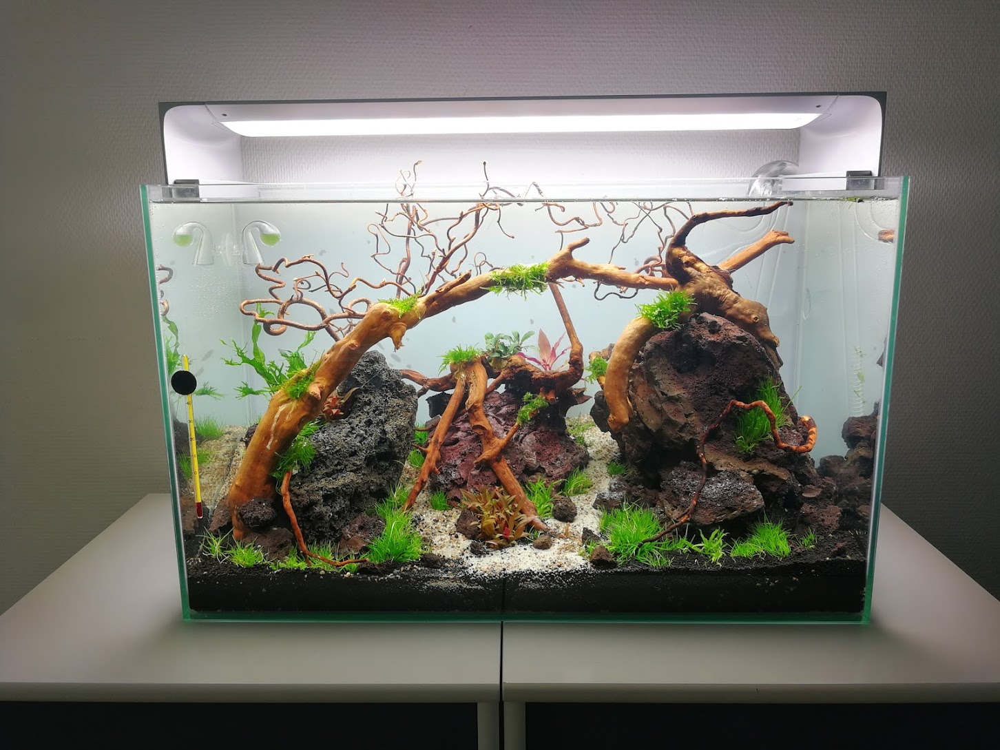

README

# Image scraping for CNN dataset

<i>May 9th: Project is currently in development, but current version is functional</i>

### Intro
This is a sub repository for a coming convolutional neural network engine to recognize aquarium fish based on user submitted images. To train the network I will need around 1000 images for each category. To make the project of aquiring the images easier I will only collect 200 images per category and then use an image generator to generate alternate copies with noise, rotated etc. Currently there is 597 different fish to categorize. More will probably be added later.
So why do I want to create that? -well in my spare time I create aqua scapes, which is a kind of advanced way of keeping aquarium, with focus of creating a scenic and nice looking setup with plants, roots and stones. From time to time I need to identify fish at different place, the petstore, aquariums at different places. It's not that I need this functionality, I just thought it would be a fun project to do.

_Early stage of one of my aquascapes_

### Goal
- This project involves retrieving a list of fish from wikipedia.
- Then we scrape images from an online database _fishbase.org_ using BeautifulSoup
- Last we scrape Google images

For each fish we have their popular name and their latin name. Once we go search for images we will only use the latin names as there often is some confusion and mixups where a common fish actually can be different species of fish.

In the process we will also clean and prepare the names (strings) as well as ignore files other than images. There is also a lot of error handling to catch errors, dead links etc.

This can be a very slow process so to speed thing up I will use the parallel functionality from Joblib to have 8 proccess running at the same time. I choose the Joblib variant as it is easy to use, and I will only have my local machine run the processes.

### Tech stack
- Python
- Beautifulsoup
- Selenium
- Regex
- Requests
- Joblib parallel processes